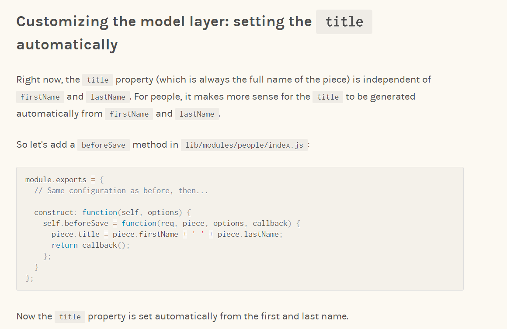

# My issue is until Pieces and Pieces Pages

## Below is my code for the issue on **construct : function** section.

```javascript
module.exports = {
    extend: 'apostrophe-pieces',
    permissionsFields : true,
    name: 'person',
    label: 'Person',
    pluralLabel: 'People',
    beforeConstruct : function(self,options){
        options.addFields= 
        [
            {
                name: 'firstName',
                label: 'First Name',
                type: 'string',
                required: true
            },
            {
                name: 'lastName',
                label: 'Last Name',
                type: 'string',
                required: true
            },
            {
                name: 'title',
                label: 'Full Name',
                type: 'string',
                required: true
            },
            {
                name: 'body',
                label: 'Biography',
                type: 'area',
                options: {
                    widgets: {
                        'apostrophe-rich-text': {
                            toolbar: ['Bold', 'Italic', 'Link', 'Unlink']
                        },
                        'apostrophe-images': {}
                    }
                }
            },
            {
                name: 'phone',
                label: 'Phone',
                type: 'string'
            },
            {
                name: 'thumbnail',
                label: 'Thumbnail',
                type: 'singleton',
                widgetType: 'apostrophe-images',
                options: {
                    limit: 1,
                    minSize: [200, 200],
                    aspectRatio: [1, 1]
                }
            }
        ].concat(options.addFields || [])
    },
    arrangeFields: [{
            name: 'contact',
            label: 'Contact',
            fields: ['firstName', 'lastName', 'phone']
        },
        {
            name: 'admin',
            label: 'Administrative',
            fields: ['slug', 'published', 'tags']
        },
        {
            name: 'content',
            label: 'Biographical',
            fields: ['thumbnail', 'body']
        }
    ],
    construct: function(self, options) {
        self.beforeSave = function(req, piece, options, callback) {
            console.log("Omit :",piece);
            piece.title = piece.firstName + ' ' + piece.lastName;
            return callback();
        }
    }
};
```
--------------
# Apostrophe Boilerplate v2.x

Apostrophe Boilerplate is a minimal starting point for [Apostrophe 2](https://github.com/punkave/apostrophe) projects.

To get started, we recommend taking a look at [our guide to creating your first project](http://apostrophecms.org/docs/tutorials/getting-started/creating-your-first-project.html). You could also take a look at [Apostrophe's CLI](https://github.com/punkave/apostrophe) or simply fork this repository.

Once you have a local copy of this project to work from, make sure to install its dependencies with `npm install`. With Apostrophe installed, the first thing to do create an admin user account so you're able to log into the CMS. Run the following command (this will prompt you for a password).

```bash
node app.js apostrophe-users:add admin admin
```

Now you're all set! Just run `node app.js` to start up the local server and head to `localhost:3000` in your web browser.

---------------

For more documentation on Apostrophe, visit the [A2 documentation site](http://apostrophecms.com).
